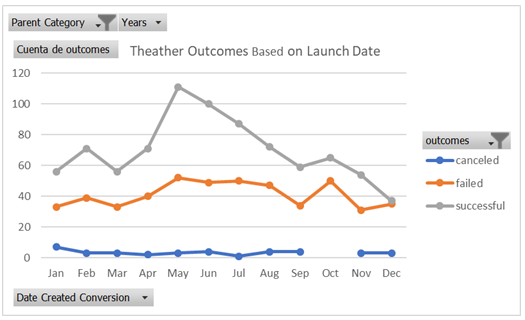
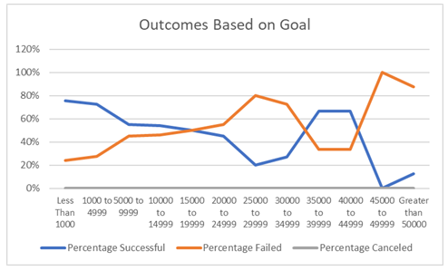

# Kickstarting with Excel

## Overview of Project

### Purpose

The main objective of this analysis is to present in a visual and comprehensive way if there is a time and amount that can contribute to the success in raising funds in Kickstarter, learning from past campaigns. It seems that there is a relationship between the date and the amount with the success of campaigs and graphs can help us to visualize this and show us a tendency.

## Analysis and Challenges

As part of the analytics process, the Analysis started with the assembly and cleaning of the data, to make it more representative of the category that was pursued to deep dive (Theather, plays). Then analyze the trends using pivot tables and graphs using launch dates and funding goals and finally wrote a small report about the insights and findings.

### Analysis of Outcomes Based on Launch Date

With the analysis of the Launch dates with the outcomes (canceled, failed, successful) two insights emerge: first seems that most successful campaigns are been launched in May and June, and by the last quarter of the year seems to be the harder period to get a successful campaign since by December we got the same amount of successful and failed, so if we can conclude with only this set of variables seem more possible to get success launching in May and June.

### Analysis of Outcomes Based on Goals

Based on the fundraising goals, seems to emerge 5 insights around the graph. First: for campaigns with less than 1,000 the percentage of failed is the lowest and the biggest percentage of success; Second: from 5,000 to 19,999 the percentage of success and failure comes very close; Third: from 20,000 to 34,999 plays seems to fail in a bigger proportion; Four: from campaigns with 35K and 44,999 seems to be one of biggest proportion in successful "plays" after "the less than 1,000" showed before. And finally "plays" looking for 45K and above has the biggest failure rate. To conclude there are two extreme types of successful fundraising campaigns those with less than 1,000 and those between 35K to 44K, which should take into consideration for the whole analysis put in context with Louise's intentions and objetives.

### Challenges and Difficulties Encountered

I think the main challenge is to conclude only taking into consideration this set of variables because there are many other variables that can be added to put them in context and make it more representative of the "play" that Louise is looking to launch, like the goal that she is pursuing, the country, and also I noticed that the currency was not taken in consideration in the formulas for this analysis which is an error that should be homologized or converted to USD.

## Results

- What are two conclusions you can draw about the Outcomes based on Launch Date?
My main conclusion, having mentioned all the limitations found in this analysis, is that there seems to be a correlation between variables pointing out that there is an opportunity window to launch a campaign on Kickstarter in the months of May and June to has more possibilities of being successful.

- What can you conclude about the Outcomes based on Goals?
On this approach just seen goals as absolute value without taking exchanges rates, there are two extreme types of successful fundraising campaigns those with less than 1,000 and those between 35K to 44K, which should take into consideration to set a strategy of fundraising.

- What are some limitations of this dataset?
For the analysis in general there are some opportunities to improve it with deep dives into "plays" like only see the outcomes for this, and breakdown by country to make it more representative since entertainment has a very local component (purchase power /Average donation).And also to see the most recent data to see if there is a change in the behavior of consumers.

- What are some other possible tables and/or graphs that we could create? There are many tables that may generate some additional insights, such as:
  - Table of trends by subcategory showing the distribution and average donation, to have market research about successful "plays" that would point out the preferences of consumers
  - Box plot by subcategory
  - Distribuition histograms
  - An exploratory analysis of blurb (word clouds)
  - Table of the average donation with purchase power by country
  - Launch date graph filter by country
  - Outcomes graph filter by country
